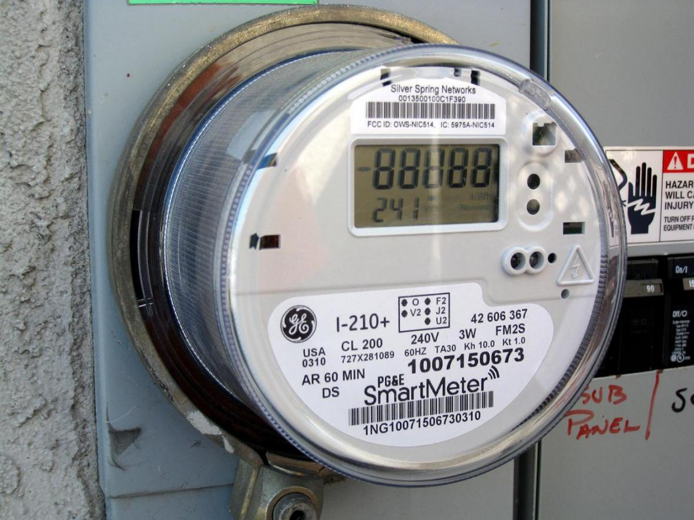
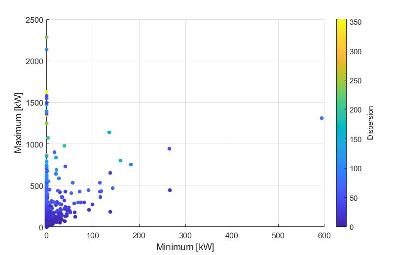
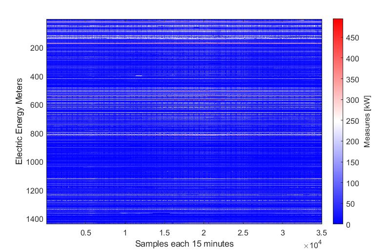
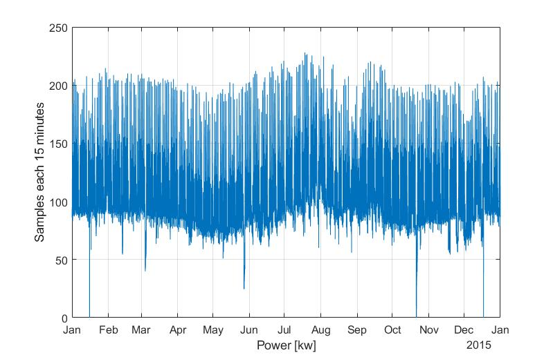
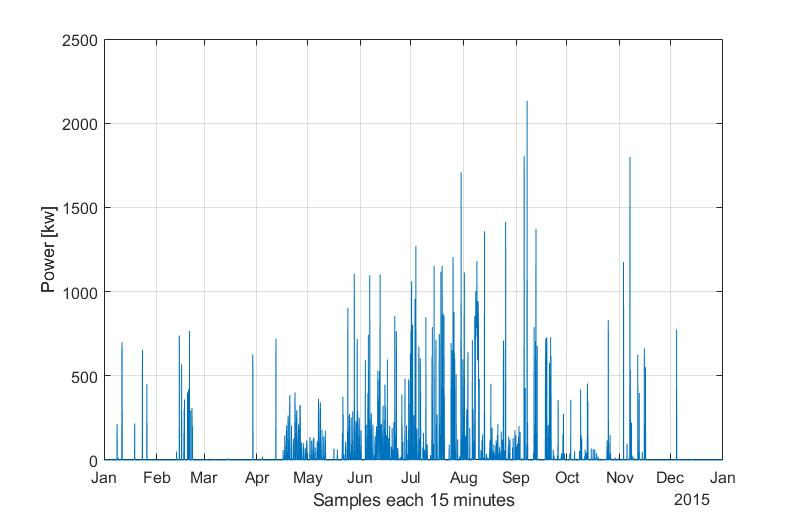
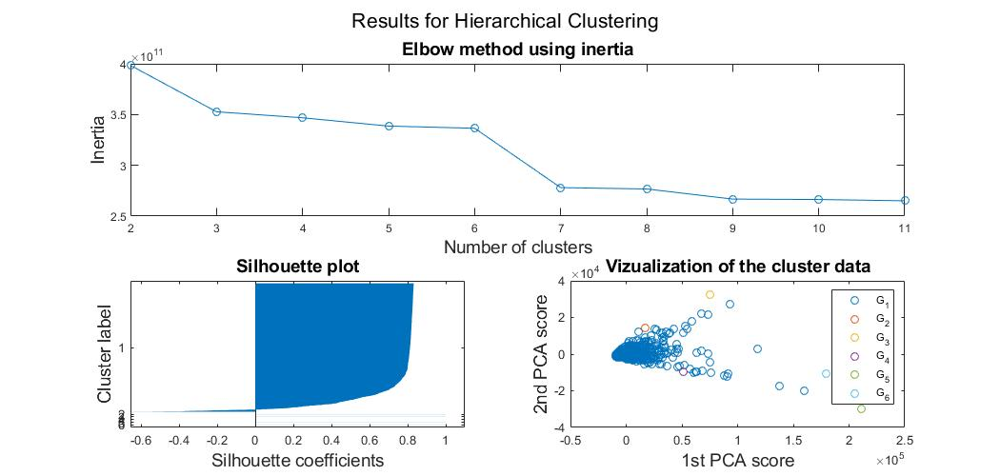
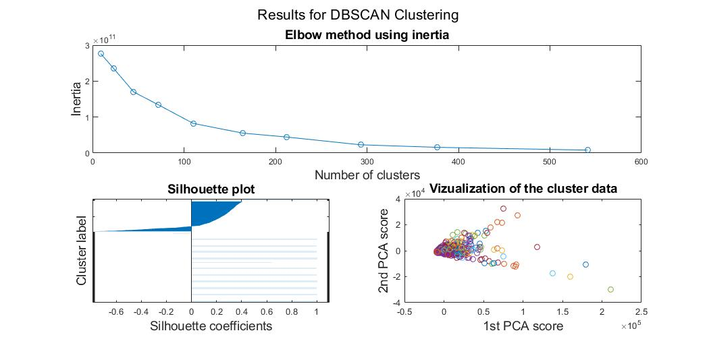
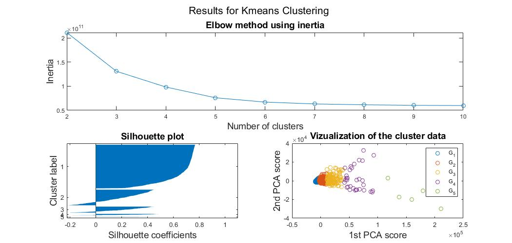
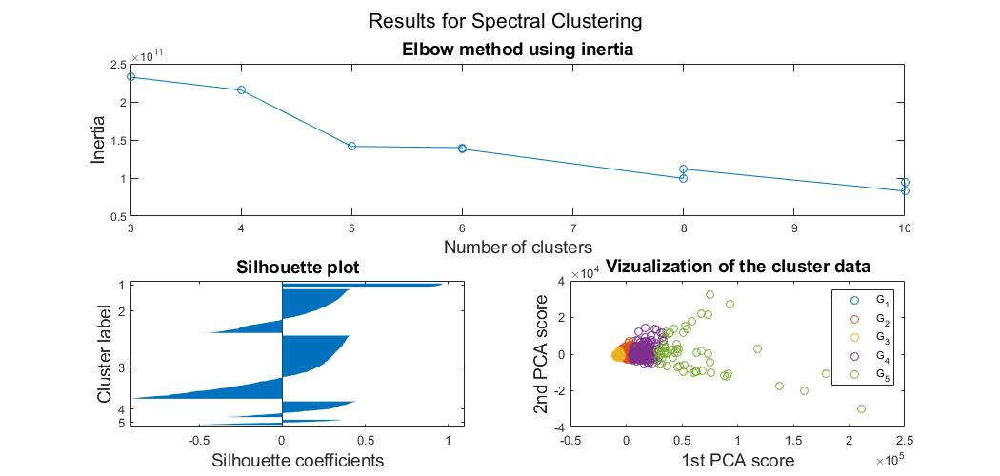

Electric Energy Meters Clustering
================
Andres Fernando Garcia
2021-06-05
<!---

-->

## Project details

The present project consists of separating into groups a dataset of
Electric Meters. The application of this work can be useful for many
purposes such as:

  - Detecting failures
  - Detecting fraudulent usage
  - Distinguish user types for tariff design
  - Demand-side management

The dataset consists of measures of **1507** smart electric meters
(after delete meters with missing data) during 1 year. Measurements are
expressed in **kilowatts \[kw\]**. The sampling period for these
measures is **15 minutes**. This results in a dataset with a size of
**1507x35040**.

## Data exploration

One of the difficulties is to explore the data through some common
exploratory charts as boxplots or histograms. This due to the huge size
of the dataset. Instead of these kinds of charts, a scatter plot with
maximum and minimum measures is shown. Further, the graph includes the
dispersion of each electric meter.

Analyzing the previous plot it is possible to conclude 2 things:

  - Most of the measurements are less than 500 kW
  - Several electric meters have non-zero measures all the time

An overview of all data with measures less than 500 kW is showed in the
next figure:

With this image, it is possible to see that most of the measurements are
**below 200 kW**. In addition, the variation of the electric power
detected by each meter was almost constant throughout the year.

The following plot shows the measures taken by an electric meter with
values less than 250 kW, supposing that the first measure was taken on
January 1, 2015, at 00:00.

The following plot shows the measures taken by an electric meter with
values greater than 500, supposing that the first measure was taken on
January 1, 2015, at 00:00.

## Results

The first clustering algorithm to be tested was hierarchical clustering.
Firstly, the Principal Component Analysis was run to perform dimension
reduction. The final
[dendrograms](https://en.wikipedia.org/wiki/Dendrogram) were divided to
get from 2 to 10 clusters and the number of clusters was selected using
[the elbow
method](https://en.wikipedia.org/wiki/Elbow_method_\(clustering\)#:~:text=In%20cluster%20analysis%2C%20the%20elbow,number%20of%20clusters%20to%20use.).

The second clustering algorithm to be tested was Density-based spatial
clustering of applications with noise (DBSCAN). Firstly, the Principal
Component Analysis was run to perform dimension reduction. The radius of
a neighborhood was selected according to the
[deciles](https://en.wikipedia.org/wiki/Decile) of all data. The final
radius of a neighborhood was selected using [the elbow
method](https://en.wikipedia.org/wiki/Elbow_method_\(clustering\)#:~:text=In%20cluster%20analysis%2C%20the%20elbow,number%20of%20clusters%20to%20use.)
with the corresponding number of clusters.

The third clustering algorithm to be tested was the classical k-means
clustering. Firstly, the Principal Component Analysis was run to perform
dimension reduction. How the number of clusters (k) was not specified,
this parameter was selected using [the elbow
method](https://en.wikipedia.org/wiki/Elbow_method_\(clustering\)#:~:text=In%20cluster%20analysis%2C%20the%20elbow,number%20of%20clusters%20to%20use.)
varying k from 2 to 10.

The final clustering algorithm to be tested was spectral clustering. In
this algorithm, it is necessary to reduce the dimensionality of the
dataset using [Locality-Preserving
Projection](https://books.google.com.ec/books?id=cH50DwAAQBAJ&pg=PA264&dq=locality+preserving+projection+clustering&hl=en&sa=X&ved=2ahUKEwjk9aXuuYHxAhWwFlkFHUgUDSAQ6AEwAHoECAYQAg#v=onepage&q=locality%20preserving%20projection%20clustering&f=false).
How the number of clusters (k) was not specified, this parameter was
selected using [the elbow
method](https://en.wikipedia.org/wiki/Elbow_method_\(clustering\)#:~:text=In%20cluster%20analysis%2C%20the%20elbow,number%20of%20clusters%20to%20use.)
varying k from 2 to 10. To plot the resulting clusters, the 1st and 2nd
scores of PCA were used.

## Analysis of results

The silhouette plot is used to select the best clustering algorithm for
this dataset. With hierarchical clustering and DBSCAN, it is possible to
note that the “main” group gathers the majority of electric meters.
According to their silhouette plots, the “main” group members are very
similar to each other. How these results have groups with few members,
they are not a good option to divide the dataset into useful clusters.
The k-means clustering and spectral clustering algorithms give groups
with many more members than the previous algorithms. If both silhouette
plots are compared, the graph of the k-means clustering shows that this
algorithm has better groups. Thus, the conclusion is that the best
clustering algorithm to separate the electric meters dataset of the
present project is the **k-means** algorithm.

